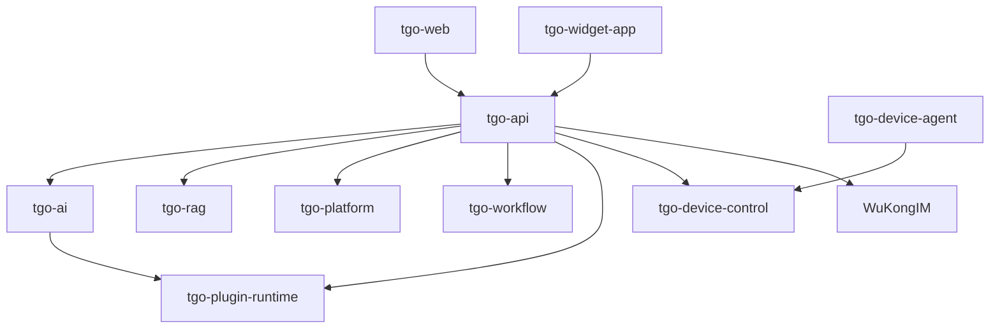

# TGO Workspace AGENTS Guide

> 适用范围：仓库根目录 `/tgo` 及其 `repos/*` 微服务  
> 最近校准：2026-03-05（按当前仓库结构与配置文件扫描）

## 1. 文档目标

本文件为 AI 代理提供“可执行”的仓库级指导，重点是：

1. 快速定位应该改哪个微服务。
2. 明确跨服务边界，避免错误耦合。
3. 在改动后执行最小必要验证，降低回归风险。

---

## 2. 先读这个：分级 AGENTS 入口

进行具体代码修改前，先看目标服务是否有本地 `AGENTS.md`：

- `repos/tgo-ai/AGENTS.md`
- `repos/tgo-api/AGENTS.md`
- `repos/tgo-rag/AGENTS.md`
- `repos/tgo-platform/AGENTS.md`
- `repos/tgo-workflow/AGENTS.md`
- `repos/tgo-plugin-runtime/AGENTS.md`
- `repos/tgo-device-control/AGENTS.md`
- `repos/tgo-web/AGENTS.md`
- `repos/tgo-device-agent/AGENTS.md`
- `repos/tgo-widget-app/AGENTS.md`

若某目录未来缺少独立 AGENTS，则按本文件 + 该服务的 `README`/`pyproject.toml`/源码结构执行。

---

## 3. 项目与架构概览

TGO 是面向客服场景的多智能体平台，核心模块包括：

- AI Agent 编排（多模型、多智能体、流式响应）
- 知识库 RAG（文档/QA/站点）
- MCP 工具体系（工具市场、自定义工具、OpenAPI 解析）
- 多渠道接入与实时通信（WuKongIM）
- 人机协作（人工客服接管）

高层依赖关系：



---

## 4. 微服务清单（当前仓库）

| 服务 | 目录 | 主要职责 | Docker 默认端口 | 本地 `make dev-*` 端口 |
| :--- | :--- | :--- | :--- | :--- |
| `tgo-api` | `repos/tgo-api` | 核心业务 API 网关、多租户主逻辑 | 8000 | 8000 |
| `tgo-ai` | `repos/tgo-ai` | LLM 接入、Agent 运行时 | 8081 | 8081 |
| `tgo-rag` | `repos/tgo-rag` | 知识解析、向量检索、RAG 任务 | 8082 | 18082 |
| `tgo-platform` | `repos/tgo-platform` | 第三方平台消息同步 | 8003 | 8003 |
| `tgo-workflow` | `repos/tgo-workflow` | 工作流执行引擎 | 8000（容器内） | 8004 |
| `tgo-plugin-runtime` | `repos/tgo-plugin-runtime` | 插件与 MCP 工具运行时 | 8090 | 8090 |
| `tgo-device-control` | `repos/tgo-device-control` | 远程设备控制服务 | 8085 | 8085 |
| `tgo-device-agent` | `repos/tgo-device-agent` | 设备侧 Go Agent（TCP JSON-RPC） | N/A | N/A |
| `tgo-web` | `repos/tgo-web` | 管理后台前端 | 80（镜像内） | 5173 |
| `tgo-widget-app` | `repos/tgo-widget-app` | 访客侧聊天组件 | 80（镜像内） | 5174 |

基础设施：

- PostgreSQL + pgvector
- Redis
- WuKongIM
- Celery（RAG / Workflow Worker）

---

## 5. 仓库结构（按实际目录）

```text
tgo/
├── repos/                    # 微服务源码
├── data/                     # 本地持久化数据卷（postgres/redis/wukongim/uploads 等）
├── scripts/                  # 部署与运维脚本
├── docs-site/                # 文档站源码
├── resources/                # README 图片与资源
├── .env.example              # 通用环境变量模板
├── .env.dev.example          # 本地开发环境变量模板
├── docker-compose.yml        # 全量容器编排
├── docker-compose.dev.yml    # 本地开发基础设施编排
├── Makefile                  # 本地开发主入口
└── AGENTS.md                 # 本文件
```

---

## 6. 技术栈基线（按当前 manifest）

- 后端：Python（以 3.11 为主，`tgo-workflow` 支持 3.10+）、FastAPI、SQLAlchemy 2、Alembic、Pydantic v2
- 异步任务：Celery + Redis（主要在 `tgo-rag`、`tgo-workflow`）
- 前端：
  - `tgo-web`: React 19 + TypeScript + Vite 7 + Zustand + React Router 7
  - `tgo-widget-app`: React 18 + TypeScript + Vite 5
- 设备侧：Go 1.22（`tgo-device-agent`）

---

## 7. AI 代理执行流程（强约束）

1. 确认目标服务与边界。
2. 阅读目标目录下的 `AGENTS.md`（若存在）与入口文件（`main.py`/`package.json`/`Makefile`）。
3. 只在必要服务改动，不跨服务复制业务逻辑。
4. 代码改动后，执行该服务最小验证命令。
5. 若涉及接口/数据结构变更，同步处理调用方（常见为 `tgo-api` 与 `tgo-web`）。
6. 输出变更说明时，明确“改了什么、为什么、如何验证”。

---

## 8. 开发规范（核心）

### 8.1 类型安全（必须）

- Python：禁止用裸 `dict` 在业务层传递结构化业务对象；禁止 `Any` 逃逸到核心业务接口。
- TypeScript：禁止 `any`；所有 API 响应、store、组件 props 需有明确类型。

### 8.2 微服务边界（必须）

- 不直接跨服务读取数据库表。
- 跨服务通信只走内部 API 或既有客户端封装。
- 不在 A 服务硬编码 B 服务私有实现细节。

### 8.3 数据库迁移（必须）

- 任何模型/表结构调整必须附带 Alembic 迁移。
- 迁移脚本应与服务代码同仓同步提交。

### 8.4 配置与密钥（必须）

- 所有环境差异走 `.env*` 或 Compose 环境变量。
- 禁止在代码中写入密钥、令牌或固定环境地址。

---

## 9. 常用命令（仓库级）

```bash
# 1) 初始化
cp .env.dev.example .env.dev
make install

# 2) 启基础设施
make infra-up

# 3) 跑迁移
make migrate

# 4) 启服务（示例）
make dev-api
make dev-ai
make dev-web
```

补充：

- 一键后台启动：`make dev-all`
- 停止本地开发进程：`make stop-all`
- 查看基础设施日志：`make infra-logs`

---

## 10. 改动后最小验证矩阵

按改动服务选择最小验证：

- `tgo-web`
  - `cd repos/tgo-web && yarn type-check && yarn lint && yarn build`
- `tgo-widget-app`
  - `cd repos/tgo-widget-app && npm run build`
- Python 服务（有测试时）
  - `cd repos/<service> && poetry run pytest`
- Python 服务（无稳定测试集时）
  - 至少启动服务或运行受影响模块的定向测试，证明改动可运行
- `tgo-device-agent`
  - `cd repos/tgo-device-agent && go test ./...`

---

## 11. 给 AI 代理的最终建议

1. 优先小步改动，避免“一次性跨 3+ 服务大重构”。
2. 涉及聊天链路时，优先检查 `tgo-api`、`tgo-ai`、`tgo-web` 的消息模型是否一致。
3. 变更端口、路由、环境变量时，同时更新 `Makefile` / Compose / 文档，避免“代码可跑但环境不可跑”。
4. 未明确要求时，不要触碰与任务无关的未提交改动文件。
